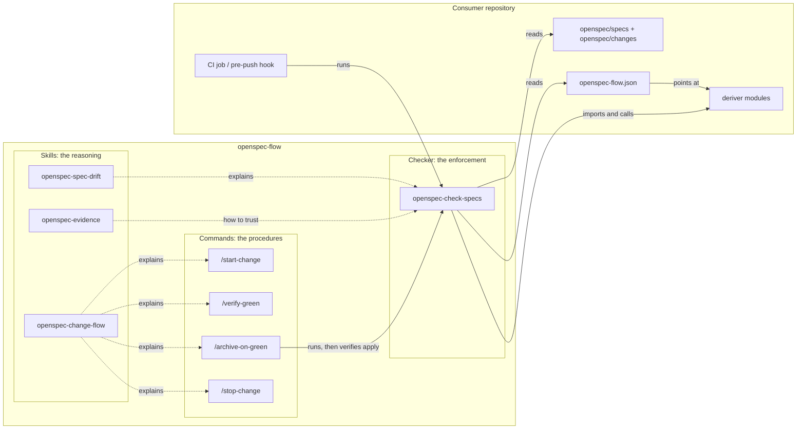

# openspec-flow — documentation

openspec-flow is a Claude Code plugin, and an npm package, for repositories that
use [OpenSpec](https://github.com/fission-ai/openspec). It gives such a
repository two things:

1. **A change flow** — the sequence a change moves through from idea to merge,
   with exactly **one human gate inside it, at merge**, bracketed by an explicit
   `/start-change` and `/stop-change`. Between the brackets nothing stops to ask
   except merge, and CI green against the current head is what triggers the
   archive.
2. **Drift checks** — a small CLI (`openspec-check-specs`) that fails when a
   specification is about to lose something silently, or when a capability that
   claims to list something from the code no longer matches the code.

The flow is where the package gets its name. The checks are what make the flow
safe to run without a gate in the middle.

## Reading order

| page | read it for |
|---|---|
| [The change flow](change-flow.md) | the sequence, where the gate is and why, what the brackets are for, what "green" means, what happens after archive |
| [Spec drift and markers](spec-drift.md) | what a `MODIFIED` delta deletes silently, the two markers and why their placement rules are opposites, the inventory seam |
| [The checker](checker.md) | how `check-specs` is built: the I/O shell, the pure core, each check, the output contract |
| [Design principles](design.md) | the rules the rest of the package follows, and what it deliberately does not do |

## The package at a glance



Three layers, each with one job:

- **Skills** carry the *reasoning*. A rule without its reason gets "simplified"
  back out, so each skill records the incident that produced the rule.
- **Commands** are the *procedures* an agent runs where getting it wrong is
  expensive: opening and closing the flow, deciding that CI is green, and
  archiving.
- **The checker** is the *enforcement*. It runs in CI and in hooks, where no
  one has to remember the skills for the rules to hold.

## Where the parts live

```
.claude-plugin/plugin.json          plugin manifest
skills/openspec-change-flow/        the flow, its one gate, its two brackets
skills/openspec-spec-drift/         MODIFIED deltas, markers, inventories
skills/openspec-evidence/           watch a check fail before trusting it
commands/start-change.md            open the flow: deserve, clean, current, free
commands/verify-green.md            is this PR green against its head?
commands/archive-on-green.md        pin, confirm, archive, verify
commands/stop-change.md             close it, or abandon it without losing work
scripts/check-specs/index.mjs       CLI entry point: all disk I/O, one subprocess
scripts/check-specs/lib/*.mjs       pure checks over text, unit-tested
scripts/check-specs/smoke-bin.sh    the bin, packed and installed as a consumer gets it
scripts/gates/refusal-cases.sh      each gate refusal, observed refusing
.github/workflows/ci.yml            unit tests on Node 20/22/24, smoke test on 22, gate refusals
```

Installation and the `openspec-flow.json` format are in the
[top-level README](../README.md).
