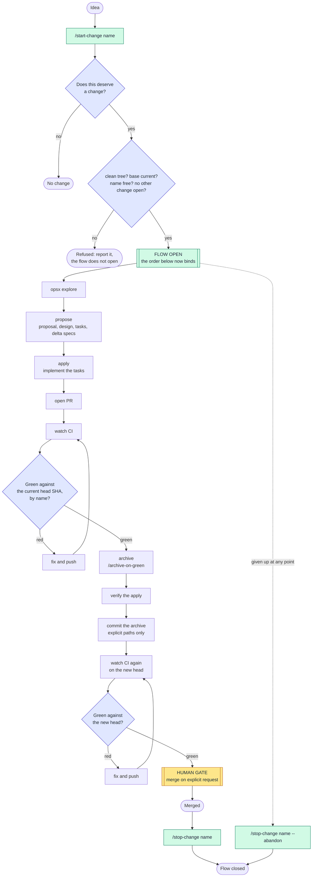
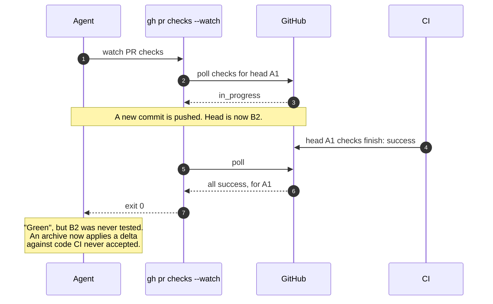
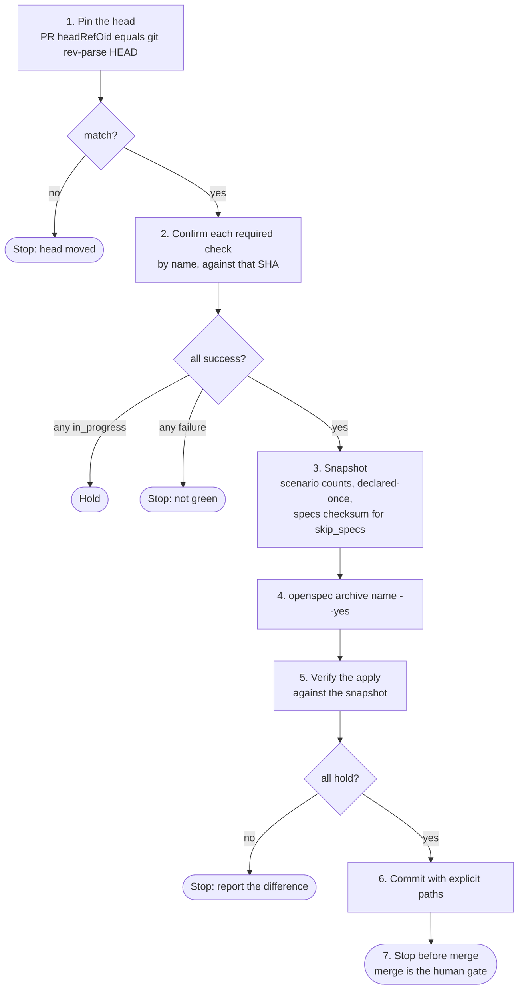
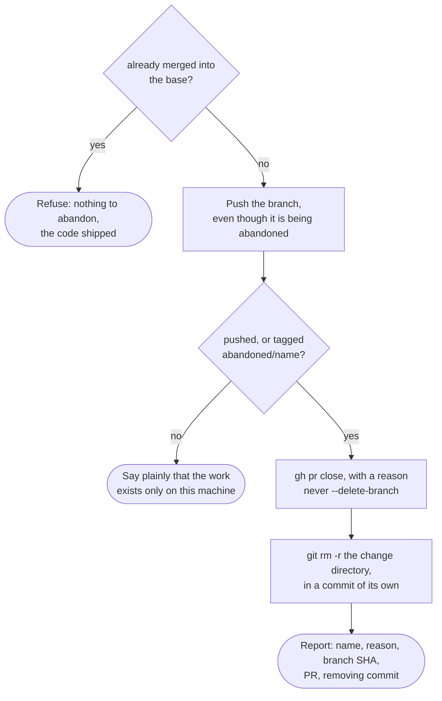
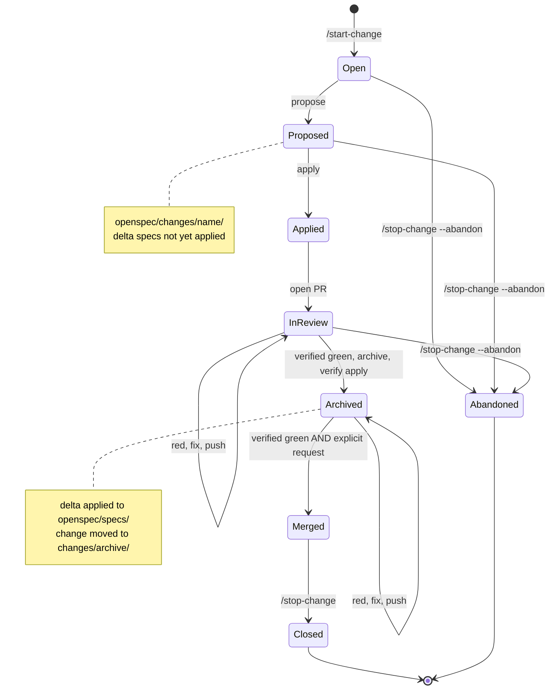

# The change flow

The flow is the path one OpenSpec change takes from idea to merged code. The
source of truth is the `openspec-change-flow` skill; this page draws it.

## The sequence



Two points need a person:

- **At the start**, "does this deserve a change at all?" is answered out loud.
  This is a judgement, and it is the decision that most often changes the
  outcome. `/start-change` is where it is answered.
- **At merge**, the change goes in only when someone asks for it.

Nothing between these two points stops to ask.

`/start-change` and `/stop-change` are the **brackets**. They do not interrupt
work; they say whether work is under way at all. Merge is the only gate *inside*
the brackets, and the count of stops per change in flight is unchanged from the
one-gate flow: one.

## Why one gate

This is not laxity. A repository that stopped twice per change — once before
committing, once before archiving — shipped a day of changes, and neither stop
ever changed anything. Reading back what each decision caught:

| decision | was it gated? | caught anything |
|---|---|---|
| does this deserve a change? | no | most of the time |
| is the implementation right? | yes | never |
| should this be archived? | yes | never |
| did I prove it or assume it? | no | every time |

The gates sat on decisions nobody was making. The archive gate could not do
better: an archive commit applies a delta and moves a folder, so it contains
nothing for a reader to judge. What the gate did instead was split one piece of
work into two states. After a push, "did you archive?" had to be asked, because
neither party knew which state the work was in.

The rule that comes out of it: **put a gate where a decision lives.**

Removing the archive gate moves the risk onto the automatic steps. The checker
and the definition of green below are what carry that risk.

### Why the brackets are not two more gates

The metric was never the number of stops. It was whether a decision lives at
each one, and the table names two decisions — the first row and the last. The
first row is the one `/start-change` puts a stop on; it was the *ungated* row
that caught something most of the time. The last is what `openspec-evidence`
exists for.

`/stop-change` adds no decision at all. It ends the ambiguity the archive gate
created. The archive gate's real defect was leaving work in a state nobody could
name, so *"did you archive?"* had to be asked; a stop that **refuses** to close
an unarchived change answers that by construction instead.

The gap they close is not hypothetical. With nothing marking the open, a change
began because an agent started behaving as though one had begun. In one session
that produced a change **merged first and archived afterwards**, in a second pull
request needing a second merge — inverting step 7 below and costing exactly the
extra gate this design exists to remove. The documented order was never
established as binding, because the flow was never explicitly opened.

## Opening the flow

`/start-change <name>` refuses without a name. Nothing is inferred: a flow that
can open itself is the state the bracket exists to end.

After the judgement is answered out loud, four checks decide whether the flow can
open at all. Each is there because a later step would otherwise measure the wrong
thing, and none of them is a preference:

| refuses | detected by | because the later step that breaks is |
|---|---|---|
| a dirty tree | `git status --porcelain` | staging explicit paths — the rule only bites when there is unrelated work to sweep in |
| a base that has moved | `git rev-list --count HEAD..origin/<base>` | the `scenarios` check, which would compare the delta against a spec the merge result does not have |
| a name already in `changes/archive/` | `find openspec/changes -maxdepth 2 -type d -name '*<name>*'` | archive itself, whose folder is named after the change, so "was this applied?" stops being answerable by looking |
| a second concurrent change | `find openspec/changes -mindepth 1 -maxdepth 1 -type d ! -name archive` | `/archive-on-green`'s name inference, and the two-state ambiguity the archive gate produced |

A name found **outside** `changes/archive/` is a resume, not a refusal. The flow
reopens on the change already proposed rather than creating a second one.

Four checks that are deliberately absent, because adding every plausible one is
how a gate becomes something people work around:

- **green CI on the base** — gates this change on someone else's red, at the
  moment least able to fix it.
- **a pushed branch** — there is nothing to push yet. Pushing matters at abandon.
- **a `check-specs` run** — with no delta yet it passes with nothing to compare.
  A green that means nothing is worse than no check: it reads as reassurance.
- **`openspec` resolvable** — a precondition of the repository, not of this
  change, and it already fails loudly at `propose`.

## What "green" means

Archive runs when CI is green, without asking. So "green" has to be exact:

> Every required check reported `success` against the **current head SHA**,
> confirmed **by name**.

An exit code is not evidence. `gh pr checks --watch` exits 0 when the PR head is
replaced during the watch:



With a manual archive this was a nuisance. With archive triggered by green, it is
a correctness bug. The same hazard appears one layer up when polling: a poll
that reaches the API before it has registered runs for a new head sees the old
head's passes. If all checks arrive at once on the first poll, instead of one by
one, suspect this.

The procedure that replaces the exit code (`/verify-green`):

```bash
SHA=$(gh pr view <n> --json headRefOid -q .headRefOid)
[ "$SHA" = "$(git rev-parse HEAD)" ] || exit 1   # head moved under you
gh api "repos/<owner>/<repo>/commits/$SHA/check-runs" \
  -q '.check_runs[] | "\(.conclusion // .status)\t\(.name)"' | sort
gh pr view <n> --json mergeable,mergeStateStatus
```

Read the result as follows:

- Every check reads `success`, and the SHA matches local `HEAD`: green.
- Any check reads `in_progress` or `queued`: hold. Do not proceed.
- `mergeStateStatus: UNSTABLE`: checks are pending. Wait for `CLEAN`.

## Archive on green

`/archive-on-green` is the procedure for the archive step. Each step exists
because skipping it once caused a problem.



### Verify the apply, do not trust it

After `openspec archive`, check that:

- each requirement is declared **once**. Hand-editing a main spec produces a
  doubled requirement.
- a `MODIFIED` requirement still carries every scenario it had, plus the new
  ones.
- for a `skip_specs` change, the specs tree is **byte-identical**. Compare a
  checksum. Do not compare by eye.
- `openspec validate --specs --strict` passes, and the capability count is the
  expected one.
- the project's own `check-specs` run passes.

Then commit the archive and let CI run again. That second CI cycle verifies the
only thing the archive commit changed.

### Stage explicit paths

Never `git add <dir>`. A directory add sweeps in unrelated in-flight change
folders. This happened once, and was caught only by reading the commit's file
list afterwards.

## Merge

Merge only on explicit request. Before merging, verify green by name against the
head SHA again — the archive commit is a new head. If the request comes while
checks are still running, say so and hold. The request is about intent, not
timing.

## Closing the flow

`/stop-change <name>` closes a change that reached its end, and **refuses while
the change is still unarchived** — the directory is still under
`openspec/changes/` rather than `openspec/changes/archive/`. That refusal is the
merged-before-archived inversion, caught by construction rather than by someone
remembering the order. It also holds while commits are unpushed or the pull
request is still open, and it never merges anything to satisfy itself.

## Abandoning a change

`/stop-change <name> --abandon` gives a change up. It requires the name
explicitly: every other step reads state, this one discards a proposal, and
inferring *which* proposal is how the wrong one gets discarded.

The ordering is the design — **preserve, then remove**:



Three things that step ordering buys:

- **The branch is pushed first.** A spike in the consumer repository survived as
  six commits on a local branch and nothing else — no remote, no pull request, no
  tag — so recovering it needed the machine it was written on. A push costs
  nothing and is the whole difference between abandoned and lost.
- **The pull request is closed, not the branch deleted.** Closing keeps the diff,
  the review and the CI history, which is most of what the attempt was worth.
  `--delete-branch` would throw away the ref the previous step just created.
- **The change directory is removed, not archived.** `openspec archive` applies
  the delta to `openspec/specs/`, publishing an accepted requirement for a change
  nobody accepted — and a spec describing behaviour no code implements passes
  every check in this package, because none of them read application code. A
  `git rm` in its own commit keeps the proposal recoverable by SHA and leaves the
  specs untouched.

Already-merged work cannot be abandoned: there is nothing to give up, and
removing the proposal would leave live behaviour unspecified.

## How the brackets were watched refusing

The gates are prose instructions, so "watch it fail first" cannot mean running
them and seeing red. What it does mean here: every refusal a gate claims must
rest on a condition that a command can **observe**, and that command must say
something different in the refusing state than in the adjacent permitting one.

`scripts/gates/refusal-cases.sh` (`npm run test:gates`, and a CI job) builds each
refusing state in a throwaway repository and reports both directions of every
boundary — 16 observations over git and the filesystem alone, with no network, no
`gh` and no `openspec`. It covers the dirty tree, the moved base, the reused name
(and the resume it must be told apart from), the second open change, the
unarchived close, a branch with no upstream, a branch ahead of its upstream, and
work already merged.

Watched failing before being trusted: narrowing the name search to `-maxdepth 1`
reddens exactly the two observations that read it, and stubbing `@{upstream}` so
it always resolves reddens exactly the no-upstream refusal.

The run prints what it does not cover, so a green is not read as more than it is:
the "does this deserve a change?" judgement, which no command decides; the
pull-request states, which need a live GitHub; and whether an agent obeys a
refusal it can see. Observability is necessary, not sufficient.

## Where each state lives



`check-specs` inspects only **unarchived** changes. Before archive, the
`scenarios` check compares each delta with the live spec. After archive, the
delta is history, and the `duplicates` and `strict` checks cover the applied
result.
