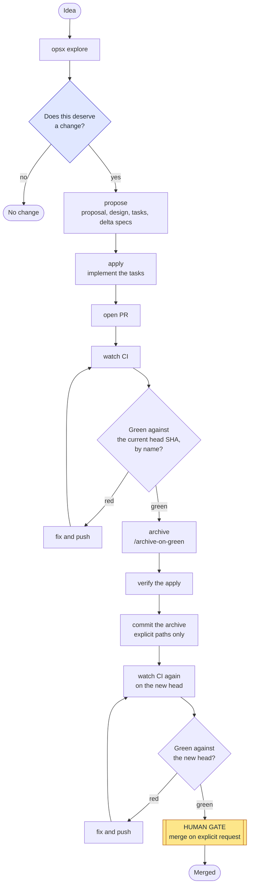
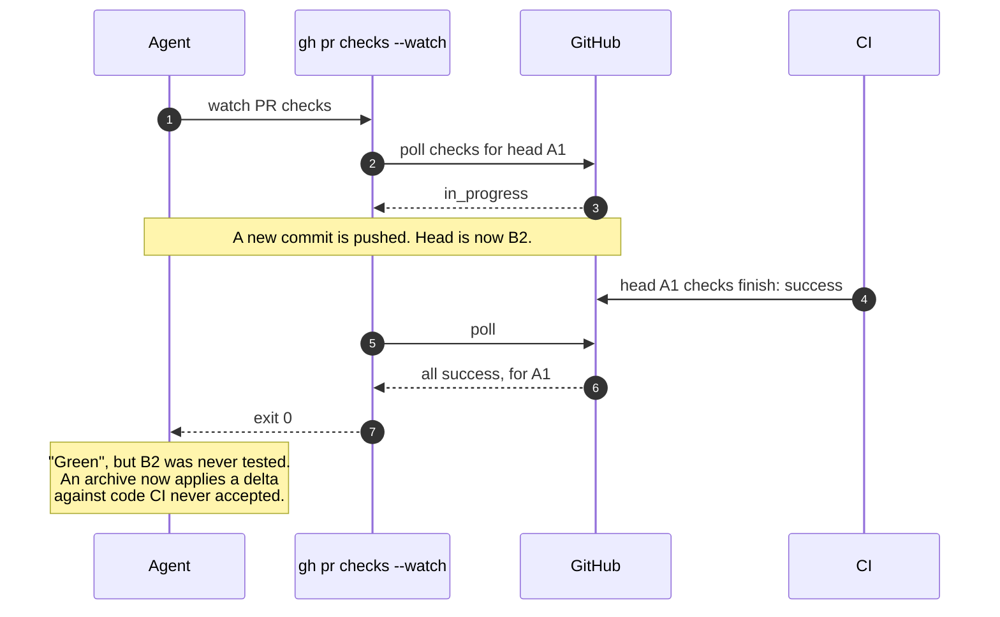
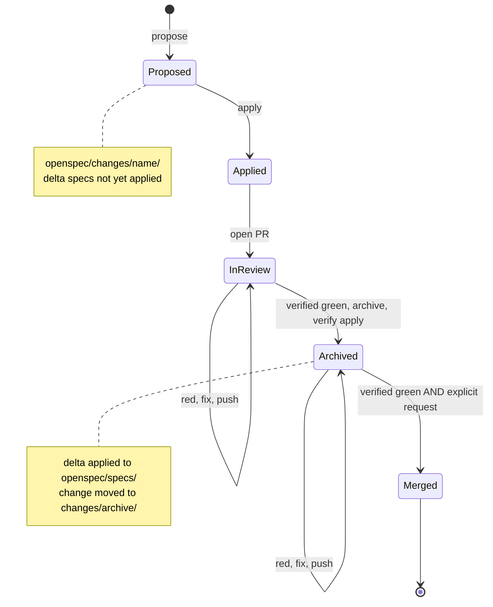

# The change flow

The flow is the path one OpenSpec change takes from idea to merged code. The
source of truth is the `openspec-change-flow` skill; this page draws it.

## The sequence



Two points need a person:

- **At the start**, "does this deserve a change at all?" is answered out loud.
  This is a judgement, and it is the decision that most often changes the
  outcome.
- **At merge**, the change goes in only when someone asks for it.

Nothing between these two points stops to ask.

## Why one gate

This is not laxity. A repository that stopped twice per change — once before
committing, once before archiving — shipped a day of changes, and neither stop
ever changed anything. Reading back what each decision caught:

| decision | was it gated? | caught anything |
|---|---|---|
| does this deserve a change? | no | most of the time |
| is the implementation right? | yes | never |
| should this be archived? | yes | never |
| did I prove it or assume it? | no | every time |

The gates sat on decisions nobody was making. The archive gate could not do
better: an archive commit applies a delta and moves a folder, so it contains
nothing for a reader to judge. What the gate did instead was split one piece of
work into two states. After a push, "did you archive?" had to be asked, because
neither party knew which state the work was in.

The rule that comes out of it: **put a gate where a decision lives.**

Removing the archive gate moves the risk onto the automatic steps. The checker
and the definition of green below are what carry that risk.

## What "green" means

Archive runs when CI is green, without asking. So "green" has to be exact:

> Every required check reported `success` against the **current head SHA**,
> confirmed **by name**.

An exit code is not evidence. `gh pr checks --watch` exits 0 when the PR head is
replaced during the watch:



With a manual archive this was a nuisance. With archive triggered by green, it is
a correctness bug. The same hazard appears one layer up when polling: a poll
that reaches the API before it has registered runs for a new head sees the old
head's passes. If all checks arrive at once on the first poll, instead of one by
one, suspect this.

The procedure that replaces the exit code (`/verify-green`):

```bash
SHA=$(gh pr view <n> --json headRefOid -q .headRefOid)
[ "$SHA" = "$(git rev-parse HEAD)" ] || exit 1   # head moved under you
gh api "repos/<owner>/<repo>/commits/$SHA/check-runs" \
  -q '.check_runs[] | "\(.conclusion // .status)\t\(.name)"' | sort
gh pr view <n> --json mergeable,mergeStateStatus
```

Read the result as follows:

- Every check reads `success`, and the SHA matches local `HEAD`: green.
- Any check reads `in_progress` or `queued`: hold. Do not proceed.
- `mergeStateStatus: UNSTABLE`: checks are pending. Wait for `CLEAN`.

## Archive on green

`/archive-on-green` is the procedure for the archive step. Each step exists
because skipping it once caused a problem.


### Verify the apply, do not trust it

After `openspec archive`, check that:

- each requirement is declared **once**. Hand-editing a main spec produces a
  doubled requirement.
- a `MODIFIED` requirement still carries every scenario it had, plus the new
  ones.
- for a `skip_specs` change, the specs tree is **byte-identical**. Compare a
  checksum. Do not compare by eye.
- `openspec validate --specs --strict` passes, and the capability count is the
  expected one.
- the project's own `check-specs` run passes.

Then commit the archive and let CI run again. That second CI cycle verifies the
only thing the archive commit changed.

### Stage explicit paths

Never `git add <dir>`. A directory add sweeps in unrelated in-flight change
folders. This happened once, and was caught only by reading the commit's file
list afterwards.

## Merge

Merge only on explicit request. Before merging, verify green by name against the
head SHA again — the archive commit is a new head. If the request comes while
checks are still running, say so and hold. The request is about intent, not
timing.

## Where each state lives



`check-specs` inspects only **unarchived** changes. Before archive, the
`scenarios` check compares each delta with the live spec. After archive, the
delta is history, and the `duplicates` and `strict` checks cover the applied
result.
