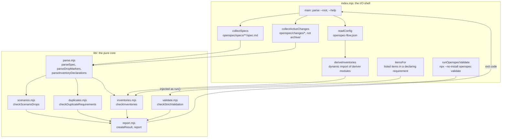
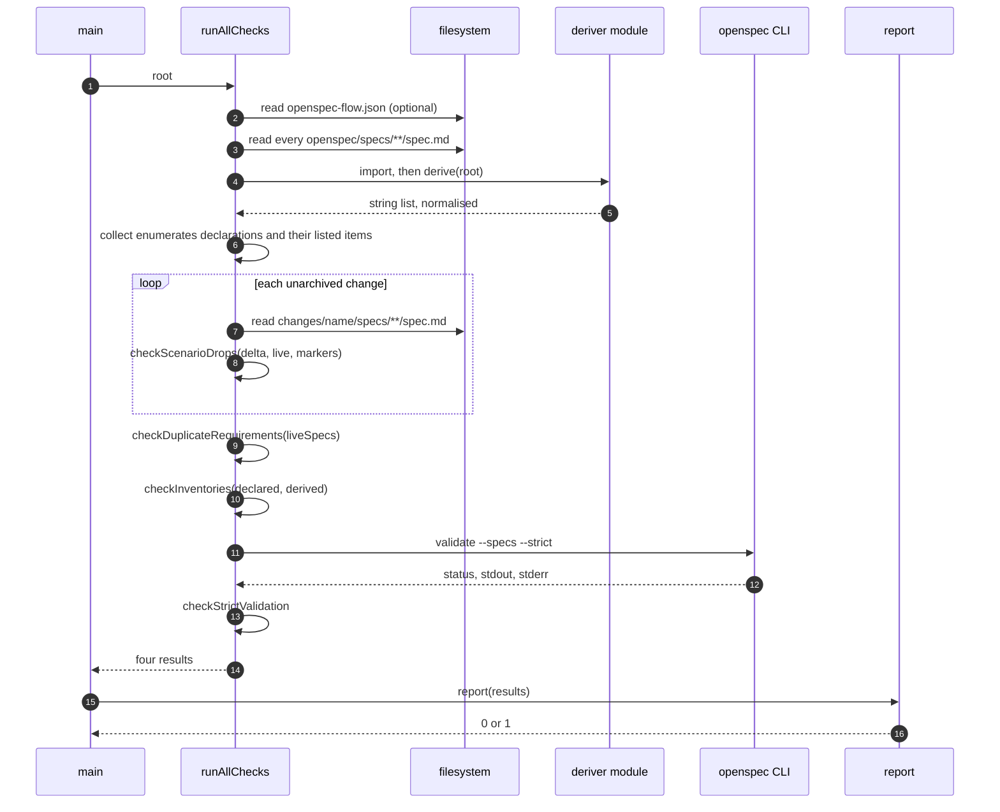
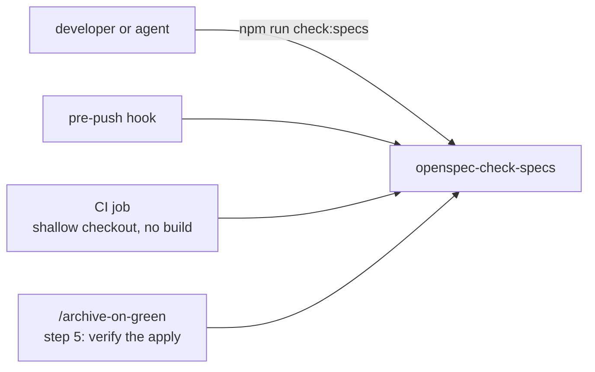

# The checker

`openspec-check-specs` (`scripts/check-specs/index.mjs`) runs four checks over
`openspec/` and exits `0` when all of them pass, `1` otherwise.

```bash
npx openspec-check-specs --root .
```

| check | fails when | needs |
|---|---|---|
| `scenarios` | a `MODIFIED` delta omits a scenario the live requirement carries | text only |
| `duplicates` | one spec declares the same requirement name twice | text only |
| `inventories` | a capability that declares it enumerates code disagrees with it | the consumer's deriver |
| `strict` | `openspec validate --specs --strict` fails | the `openspec` CLI |

## Shape: an I/O shell around a pure core

`index.mjs` owns every disk read and the one subprocess call. Each module under
`lib/` is a pure function over text. That split is why the 37 unit tests need no
fixtures on disk.



`validate.mjs` receives the subprocess as an injected `run()` function. Its
tests exercise the output parsing without starting a real CLI.

## One run, in order



## The checks

### `scenarios` — a delta cannot discard a scenario silently

For each unarchived change, each delta spec is parsed and each `MODIFIED`
requirement is matched by name with the live requirement. A live scenario that
is neither in the delta nor named by a `drops-scenario` marker is a finding.

The check runs **before** the archive, against the live spec. It fails before
the destructive operation, and it needs no git history. See
[Spec drift and markers](spec-drift.md) for the marker rules.

### `duplicates` — one requirement name per spec

Archive applies a delta **by requirement name**. The same name twice in one spec
means that a delta was applied on top of a capability that already held it. The
copies drift apart as soon as a later delta modifies one of them. The usual
cause is hand-editing a main spec instead of letting `openspec archive` apply
the delta. The same name in two different capabilities is fine.

### `inventories` — a declared enumeration is held to the code

Each `<!-- enumerates: X -->` declaration is compared in both directions with
the items that the configured deriver for `X` returns. Listed items are read
from the requirement's own prose, before its first scenario, as backticked
`METHOD path` entries (`GET|PUT` expands to two items). The consumer's
`normalise` is applied to both sides before the comparison. See
[the inventory seam](spec-drift.md#the-inventory-seam).

### `strict` — OpenSpec's own validator

The check runs `openspec validate --specs --strict` instead of reimplementing
it. Strict validation is the tool's contract and changes with the tool. A local
copy would diverge.

- Exit `0` passes, whatever the output says. `[INFO]` notices are advice.
- A non-zero exit with named failing items gives one finding per item.
- A non-zero exit whose output names no items still fails, and prints the last
  lines of the output. The CLI output format may have changed.
- A CLI that cannot start (status `null`, `error` set) is reported as status
  `127`, not as a pass.

Pin the CLI as a devDependency in the consumer repository, with its scope:
**`@fission-ai/openspec`**. The unscoped `openspec` package on npm is an
unrelated stub at `0.0.0`.

## Output contract

Every check returns `{ checker, failures[] }`. Each failure is `{ what, fix }`.
The report prints one line per failure:

```
<checker>: <what> — <how to fix>
```

A passing run prints one summary line:

```
specification checks passed (4): scenarios, duplicates, inventories, strict
```

A failing run ends with a count:

```
scenarios: add-expiry -> auth: MODIFIED requirement "Session expiry" omits 1 scenario(s) the live spec carries: "absolute timeout" — a MODIFIED requirement replaces its counterpart in full, so copy each scenario into the delta — or, if the removal is deliberate, add `<!-- drops-scenario: <Requirement> :: <Scenario> -->` above the first `##` header naming it
1 specification failure(s) across 4 check(s)
```

Each failure says what to do next. A finding without a fix gets ignored.

## Wiring it in

The checker needs no build, no database, no credentials and no git history. Give
it its own CI job with a shallow checkout, instead of adding it to a job that
builds. Run it from three places:



## Two bugs the structure guards against

Both failures were silent and green. Both were found by running the real path
instead of assuming it:

- **The bin symlink.** npm installs a `bin` as a symlink, so `process.argv[1]`
  is `node_modules/.bin/openspec-check-specs` while `import.meta.url` is the
  real file. A naive "invoked directly?" test fails, `main` never runs, and the
  process exits `0`. A CI job calling the bin would pass forever without
  checking anything. `invokedDirectly()` compares both paths through
  `realpathSync`.
- **The empty test list.** `run-tests.sh` passes an explicit list of files to
  `node --test`, because Node versions disagree about directories and globs. If
  the list is empty, `node --test` discovers tests from the working directory
  and reports success. The script exits `1` instead.

## Running the tests

```bash
npm test
```

This runs `scripts/check-specs/run-tests.sh`. Do not use
`node --test scripts/check-specs/`: passing a directory fails on Node 22 and 24,
and passing a glob fails on Node 20.
