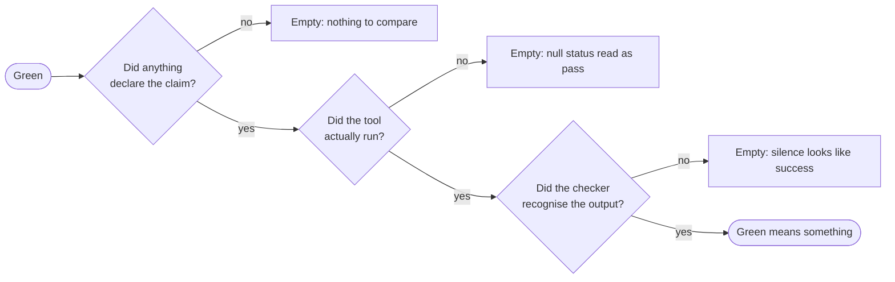

# Design principles

The package came out of one repository, where each rule was learned from a real
failure. The rules could not travel to other repositories until they were
written down with their reasons. These are the principles the rest of the
package follows.

## 1. Gate where a decision lives

A gate is worth its cost only where someone makes a decision. In the source
repository, the gates before commit and before archive never changed an outcome,
and they split the work into states that nobody could track. So the flow has one
gate, at merge, plus an explicit "does this deserve a change?" at the start.
See [The change flow](change-flow.md#why-one-gate).

## 2. Evidence, not exit codes

Removing gates is safe only if "green" is exact. An exit code is a claim, not
evidence: `gh pr checks --watch` exits `0` for a head it never tested. Green
means each required check, by name, against the current head SHA.

## 3. Watch a check fail before trusting it

A check that has never been seen failing proves nothing when it passes. Break
exactly one thing, confirm that the report names that thing and nothing else,
restore it, and confirm green again. The `openspec-evidence` skill lists the
three ways a green check can be empty:

The checker is built to fail loudly in each case. A deriver that cannot load
or throws is a finding, a CLI that cannot start is status `127`, and output that
the checker does not recognise is printed and fails.

## 4. Declare intent, never infer it

An accidental scenario omission and a deliberate removal look the same in a
file. A passing mention of a route and a claim of completeness look the same.
So intent is always stated with a marker (`drops-scenario`, `enumerates`), and
without a marker the checker assumes nothing. An undeclared inventory passes. An
undeclared omission fails.

## 5. Place a marker by what it describes

`openspec archive` copies requirement bodies into the main spec. A marker about
**the change** goes where archive cannot reach it. A marker about **the
capability** goes where archive carries it. See
[Spec drift and markers](spec-drift.md#two-markers-opposite-placement-rules).

## 6. Fail before the destructive step

The `scenarios` check compares a delta with the live spec **before** archive.
It reports "this would delete a scenario" instead of "a scenario is gone". This
also means that it needs no git history.

## 7. Keep what is stack-specific at a seam

Three of the four checks are text comparisons with no knowledge of the
consumer's stack. The one check that must read code (`inventories`) does so
through a deriver module that the consumer owns and configures in
`openspec-flow.json`. The package defines the contract (`derive`,
`normalise` on both sides), not the implementation.

## 8. Pure core, thin shell

All disk I/O and the one subprocess are in `index.mjs`. Everything under `lib/`
is a pure function over text, with injectable effects (`run`, `write`). The
tests need no fixtures, and each check can be reasoned about alone.

## 9. Delegate to the tool's own contract

The `strict` check runs `openspec validate --strict` instead of copying its
rules. The tool's definition of valid changes between versions, and a local copy
would drift from it.

## 10. Keep the reason with the rule

A rule without its reason gets "simplified" back out. So each skill records the
incident behind each rule, and the code comments explain *why*, not *what*.
When you change a rule, read the reason first.

## What the package does not do

- **It does not tell you whether a requirement is still true.** No check reads
  application code directly, so a spec with a stated reason that stopped being
  true passes every check. That needs a reader.
- **It does not decide what deserves a capability.** An inventory that nothing
  declares passes silently. That decision is a judgement.
- **It does not merge.** Merge is the one human gate.
