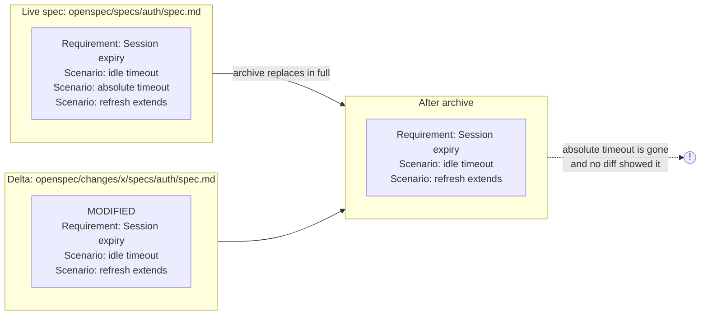
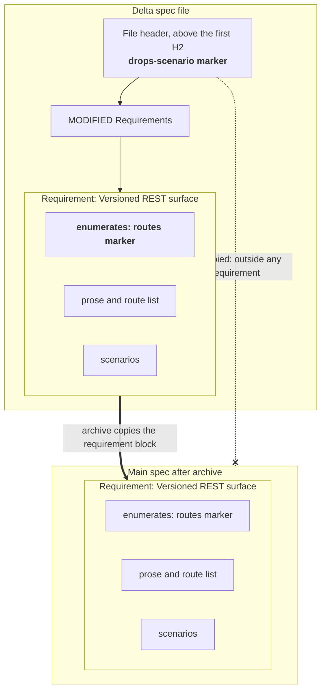
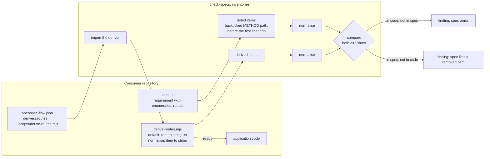

# Spec drift and markers

A specification drifts in two ways: it loses something without anyone seeing it
go, or it stops describing the code while it still looks correct. This page
explains both, and the two markers that let a spec author state intent. The
source of truth is the `openspec-spec-drift` skill.

## What a `MODIFIED` delta deletes silently

`openspec archive` replaces a live requirement with its `MODIFIED` counterpart
**in full**. A scenario that the delta leaves out is deleted, and the diff does
not show it. The delta looks complete by itself. The deletion exists only
relative to a file the reviewer is not reading.



The `scenarios` check catches this **before** the archive. It compares the
scenario names of each `MODIFIED` requirement with its live counterpart:

- The comparison is by scenario **name**. A reworded body is a modification,
  not a removal.
- Only `MODIFIED` is checked. `ADDED` has no counterpart to lose. `REMOVED` and
  `RENAMED` do not replace in full.
- A `MODIFIED` requirement with no live counterpart is a finding by itself. It
  is usually an `ADDED` requirement under the wrong header.

A deliberate removal is stated, not inferred:

```markdown
<!-- drops-scenario: Session expiry :: absolute timeout -->
```

Each marker names one scenario. A marker for one omission cannot silence another
omission in the same requirement.

## Two markers, opposite placement rules

One fact decides where both markers go: **`openspec archive` copies a
requirement's body into the main spec.**



| marker | describes | must survive archive? | placement |
|---|---|---|---|
| `drops-scenario` | one change | no | **above** the first `##` |
| `enumerates` | the capability | **yes** | **inside** the requirement |

- A **drop marker** is a note to the checker about one change. If archive
  copied it into the main spec, it would sit inside a behaviour contract
  forever. So it goes above the first `##`, where archive cannot reach it. A
  drop marker below that line is ignored, and the check stays red until the
  marker moves.
- An **inventory declaration** is a permanent property of the capability, and
  it must survive archive. So it goes inside the requirement, where archive
  carries it. An `enumerates` marker outside any requirement is ignored.

The rule that generalises is not "markers go at the top". It is: **does the
marker describe the change, or the capability?** Getting this backwards fails
silently in one direction and loudly in the other.

## The asymmetry that lets a spec rot

When the same fact is listed in a document **and** in a specification, and only
the document is compared with the code, the document stays correct and the
specification rots.

Observed case: a capability said "this list is the whole surface — a route that
exists but is absent here is a spec defect", and had a scenario that asserted
the comparison holds. For six weeks it was missing five of twenty-three routes.
The prose documentation was correct the whole time, because a docs checker
compared it with the code and nothing compared the spec.

A capability opts in to the same comparison with a declaration inside the
requirement that makes the claim:

```markdown
### Requirement: Versioned REST surface

<!-- enumerates: routes -->

The system SHALL expose the following endpoints:

- `GET /api/v1/widgets`
- `GET|PUT /api/v1/widgets/:widgetId`
```

Only a **declared** inventory is checked. A capability that mentions a route in
passing does not claim completeness. An inventory that no capability declares
passes: deciding that something deserves a capability is a judgement, not a
defect.

## The inventory seam

The package cannot know how to list your routes. They come from NestJS
decorators in one repository, an Express router in another, and an OpenAPI
document in a third. So the derivation is a **seam** that the consumer
repository fills:



`normalise` is applied to **both** sides. Only the consumer knows that `:id` and
`:widgetId` are one route, or that a query string is not part of a path. If
normalisation runs on only one side, every spelling difference reads as drift.
That was the first bug this seam produced. It was found by running the plugin
against a real repository whose local version normalised both sides inside one
function.

Failure modes that the check reports, rather than passing silently:

- The deriver path does not exist.
- The deriver module exports no function.
- The deriver throws. A deriver that cannot run must not read as "nothing
  drifted".
- A declaration names an inventory that nothing derives. A misspelled marker
  otherwise leaves the claim unenforced while it looks enforced.

## What no checker can tell you

No check reads application code directly. The checks compare specifications with
specifications, plus whatever a configured deriver extracts. So no check can say
whether a requirement is still **true**.

Worked example: a capability's Purpose explained that squash-merge turns the PR
title into the commit message, in a repository that had used rebase-merge for
seven weeks. The spec was structurally perfect and every check was green, but the
stated reason was false.

That class of drift needs a reader. A mandatory Docs task group in each change
is where that reading happens.
